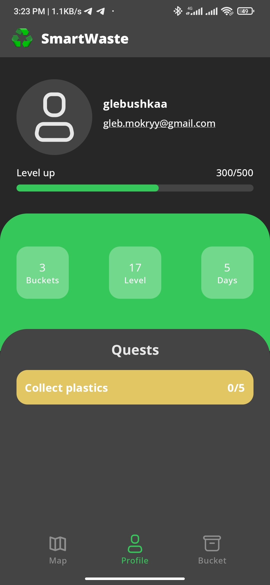
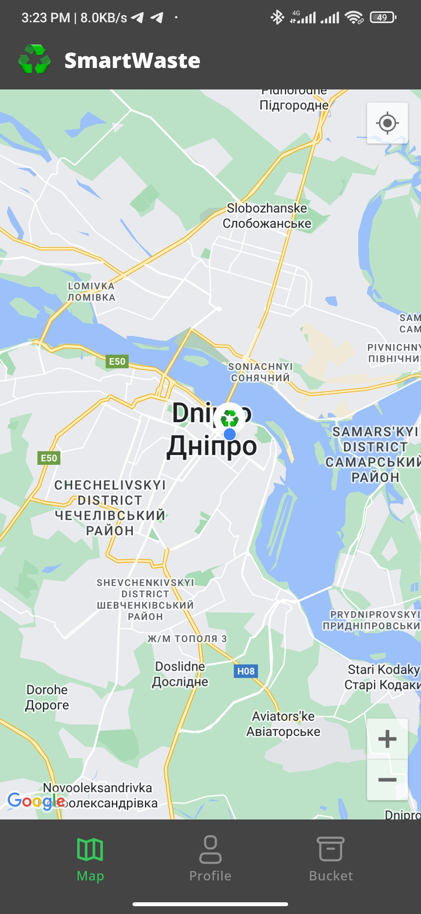
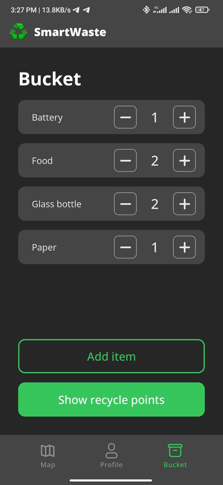

# SmartWaste for Android - README


## Screenshots

<div style="display: flex; justify-content: space-between;">
    
    
    
</div>

## Table of Contents

- [Introduction](#introduction)
- [What is SmartWaste](#what-is-smartwaste)
- [Features and Innovations](#features-and-innovations)
  - [Interactive Collection Points Map](#interactive-collection-points-map)
  - [AI for Waste Recognition](#ai-for-waste-recognition)
- [Getting Started](#getting-started)
  - [Installation](#installation)
  - [Usage](#usage)
- [Tools](#4-tools)
- [Contributing](#contributing)
- [License](#license)

## Introduction

Welcome to the world of SmartWaste - an innovative program designed to simplify waste sorting processes and educate users on eco-friendly habits! This document provides information on how to use the program, its features, and benefits.

## What is SmartWaste

SmartWaste is a program designed to simplify waste sorting for those lacking experience in this area. It offers an intuitive interface and incorporates gamification elements for user convenience.

## Features and Innovations

### Interactive Collection Points Map

Discover the locations of waste collection points and their functionalities using the interactive map.

### AI for Waste Recognition

Utilize modern technology for automatic waste type recognition based on photographs.

## Getting Started

Follow these instructions to get a copy of the project up and running on your local machine for development and testing purposes.

### Installation

1. Clone the repository to your local machine using Git:

```shell
 git clone https://github.com/glebushkaa/smart-waste-android
```

2. Open the project in Android Studio.
3. Build and run the app on the Android Emulator or a physical device.

## Usage
1. Launch the GuideBook app on your Android device or emulator.
2. Explore the list of available guides.
3. Tap on a guide to view its details.
4. To mark a guide as a favorite, tap the heart icon.
5. Use the navigation features to browse guides and discover steps for them.

## Tools
- Jetpack Compose - The Android Jetpack components used to build the app's user interface.
- Retrofit - Used for making network requests.
- RestAPI - is made for fetching requests.

## Contributing

We welcome contributions from the community. If you'd like to contribute to the project, please follow our Contributing Guidelines.

## License

This project is licensed under the MIT License - see the LICENSE file for details.
